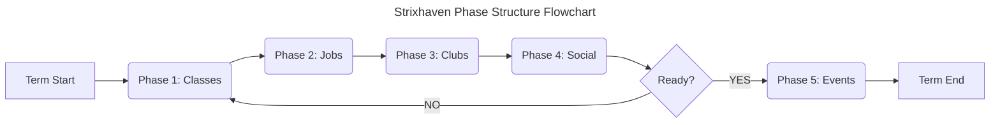

# [DMSG](../../README.md) / [Official Modules](../README.md) / Strixhaven

This is how I run Strixhaven.

## Module Introduction

Okay, so a lot of people don't like Strixhaven due to how barebones it is. I'm not going to get into that right now, but I will say that I think it's a great module for new DMs due to how much it forces you to improvise. It's also a great module for experienced DMs who want to try something new and would rather not have to worry about a lot of prep work as it does a lot of the heavy lifting for you.

## Phase Structure

Repeat the following phases for each set school term as many times as you want per school year.

### Phase 1: Classes

### Phase 2: Jobs

### Phase 3: Clubs

### Phase 4: Social

### Phase 5: Events

## Sources

- ["How I Run Strixhaven" by UserIsInUse](https://www.youtube.com/watch?v=Sd3N8WJB9_g)
- ["Strixhaven Supplemental Volume I: Course Catalog and Staff Directory" by Alex Crews](https://www.dmsguild.com/product/381005/Strixhaven-Supplemental-Volume-I-Course-Catalog-and-Staff-Directory)
- ["Strixhaven Supplemental Volume II: The Rulebook" by Alex Crews](https://www.dmsguild.com/product/381009/Strixhaven-Supplemental-Volume-II-The-Rulebook)
- ["Strixhaven Supplemental Volume III: Creature Compendium and Item Index" by Alex Crews](https://www.dmsguild.com/product/382019/Strixhaven-Supplemental-Volume-III-Creature-Compendium-and-Item-Index)
- ["Strixhaven Supplemental Volume IV: The Bulletin Board" by Alex Crews](https://www.dmsguild.com/product/381335/Strixhaven-Supplemental-Volume-IV-The-Bulletin-Board)
- ["Strixhaven: A Syllabus of Sorcery" by Mike Bernier (Arcane Eye)](https://www.dmsguild.com/product/379795/Strixhaven-A-Syllabus-of-Sorcery)
- ["Students of Strixhaven" by Craig Mackie](https://www.dmsguild.com/product/380881/Students-of-Strixhaven)
